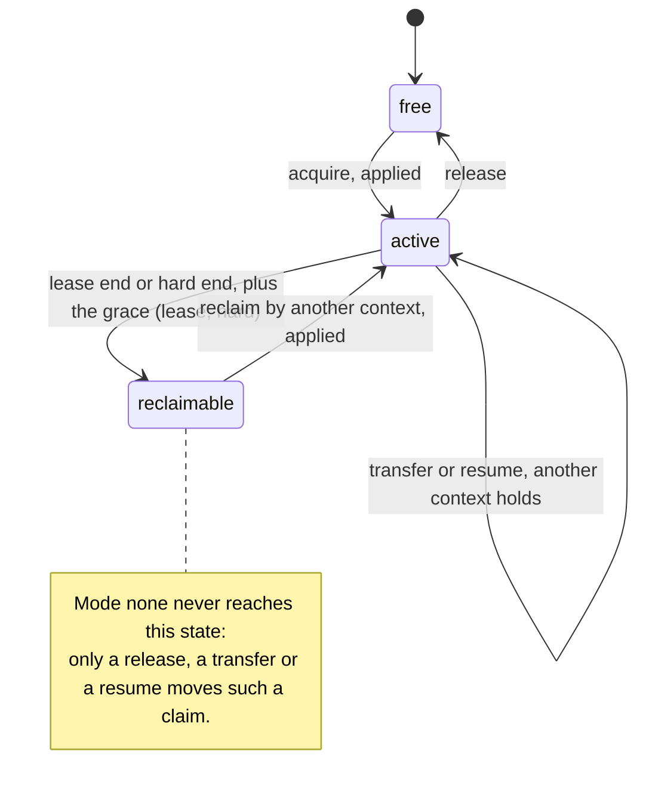
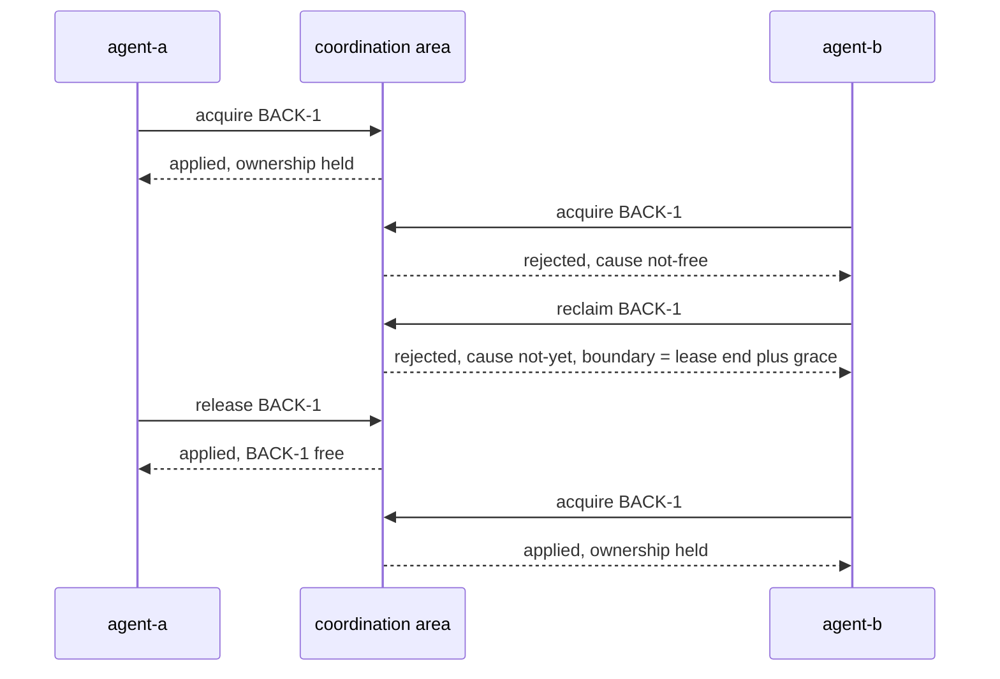
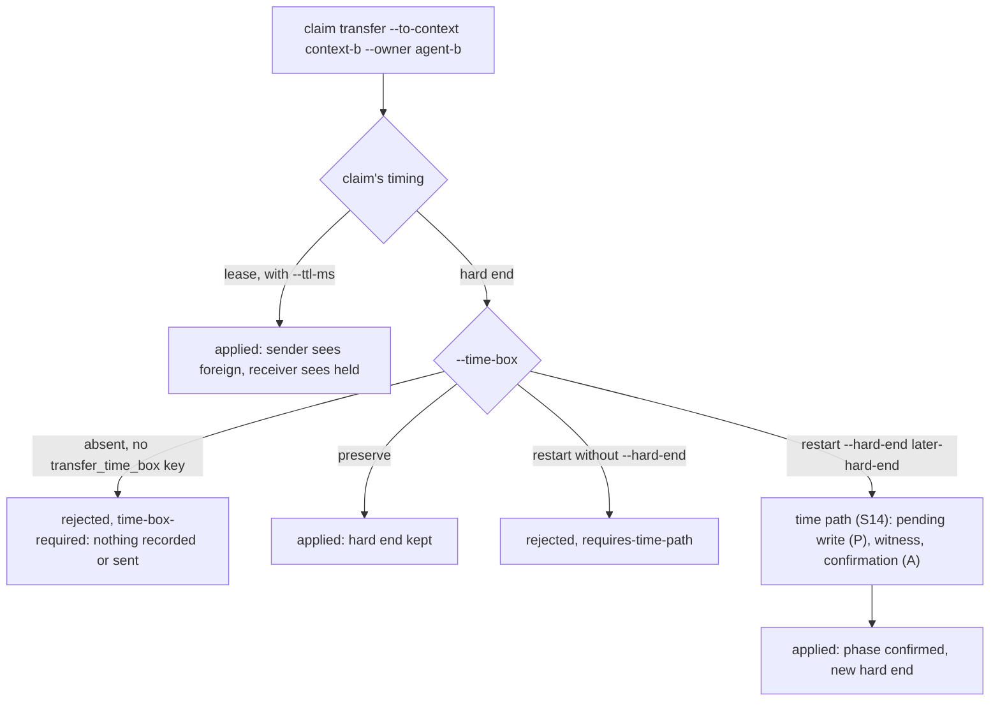
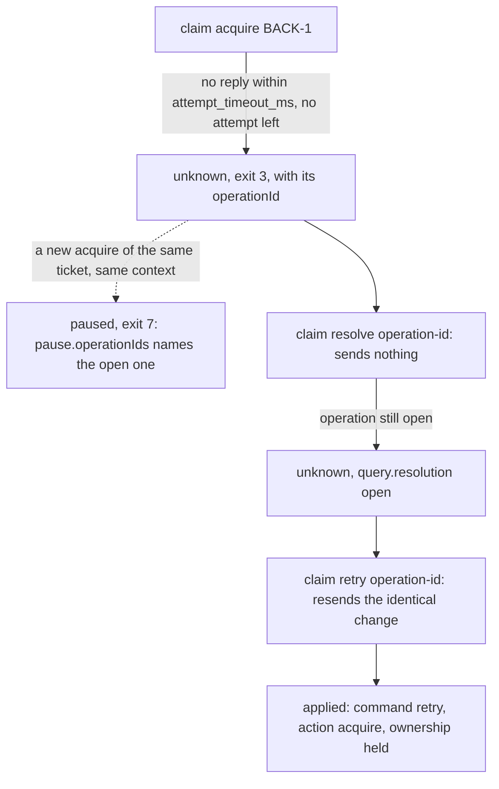
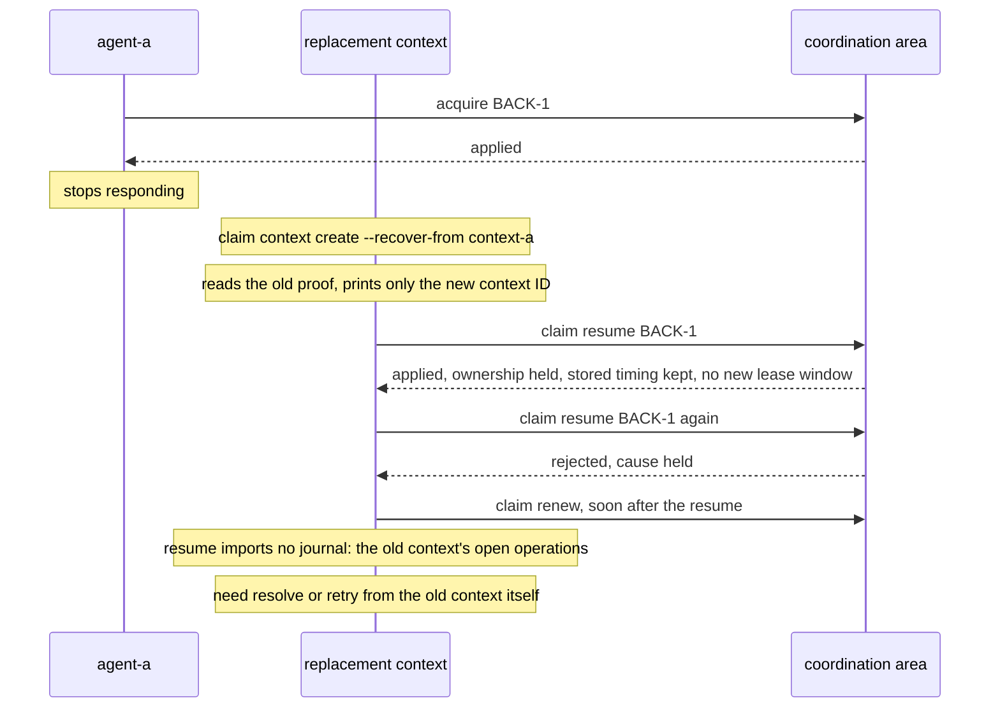

# Claims

Claims let several agents, or several people, work in one backlog without two of them picking up the same ticket.
This document explains what a claim is and walks through the everyday workflows and the failure cases with commands
you can run. It ends with what claims do not do and how to read their JSON. The reference that specifies every
command, code and field is the claims guide, `backlog instructions claims`; this document shows it at work.

## What a claim is

- **One valid claim per ticket.** A claim records which agent works on a ticket right now. It lives in a shared Git
  coordination area, not in the task file: claim commands never change a task's status, assignee or content, and
  never commit.
- **Every change is one atomic, conditional write.** An acquire lands only if the ticket is still free, a renew only
  if the claim is still yours. When another agent was faster, the command ends `rejected`; nothing is overwritten.
- **A claim is not the assignee.** The assignee (`task edit -a`) says who is responsible for a ticket. A claim says
  who holds it at this moment. Claims never read or write the assignee.
- **Three lifetime modes.** The `lifetime_mode` key of the project's `claims:` block decides how a claim ends:
  - `lease`: the claim runs for a window (`--ttl-ms`, else `lease_ttl_ms`) and has to be renewed. Once the lease end
    plus the grace (`reclaim_grace_ms`) has passed, another agent may reclaim it. A lease claim can also carry a hard
    end (`--hard-end`) that no renewal passes.
  - `hard`: every claim needs a hard end, a fixed instant given with `--hard-end`. After the hard end plus the grace
    it may be reclaimed.
  - `none`: the claim has no time limit. It is never reclaimable, so only a release, a transfer or a resume moves it.
- **Contexts are private directories.** `backlog claim context create` makes a context inside a parent directory
  with mode 0700. Its absolute path, the handle, is passed as `--context` to every command that changes a claim. The
  context holds the proof that the claim is yours and the journal of your operations. Give each agent its own
  context and never copy one: a copy cannot be told apart from its original.
- **`--owner` is a display name only.** It shows who holds a claim, and `--claim-owner` filters by it, but it is never
  an identity. What makes a claim yours is the context.

The lifetime of one claim, across the three modes:



## Setup

A project needs three commands once. `backlog claim setup` writes the `claims:` block into the project configuration.
It needs the Git URL of the coordination area (`--endpoint`, a `git://`, `ssh://`, `http://`, `https://` or `file://`
URL every agent can push to), the storage format (`blob`, `tree` or `commit-chain`) and the largest deviation of any
host clock from the true time (`--clock-uncertainty-ms`). Keep every participant's clock NTP-synchronised; claims
assume it and tolerate only the configured uncertainty. It writes twelve keys, among them `enabled: true`,
`lifetime_mode: lease`, `lease_ttl_ms: 300000` and `reclaim_grace_ms: 600000`, and never overwrites an existing block.
`backlog claim init` then creates the coordination area; running it again reports `exists`. Each agent finally
creates its own context with `backlog claim context create`, which prints only the context ID. The handle is the
parent directory followed by that ID. Which hosts, transports and sizes were tested, and with which bounds, is in
the [evidence repository](https://github.com/lunetics/backlog-md-claims-qualification): Linux only; macOS, Windows and NFS were
not tested.

```text
backlog claim setup --endpoint <endpoint> --storage-format blob --clock-uncertainty-ms 2000 --json
backlog claim init --json
backlog claim context create --parent <private-dir> --json
```

The endpoint URL never carries credentials: `user:password@` and token-in-URL forms are refused as `config-invalid`
with the problem `unsupported-endpoint` on `claims.endpoint`. Authenticate with SSH keys or a Git credential helper;
both are ordinary Git configuration and pass through unchanged.

`backlog config set` does not accept claims keys. To change one, edit the `claims:` block of the project
configuration; the scenarios below show each change they need as a YAML snippet.

## Everyday workflows

Each scenario is a numbered sequence of commands. Every step shows one command and says what it prints; the Markdown
source of this file carries the same result in a comment above each command, and the test suite runs every scenario
against a real Git coordination area. The examples use these placeholders:

- `<endpoint>`: the Git URL of the coordination area.
- `<private-dir>`: a directory with mode 0700 that holds the contexts.
- `<context-a>` and `<context-b>`: the handles of two agents' contexts, each `<private-dir>` followed by the ID that
  `context create` printed.
- `<context-a-recovered>`: the handle of a replacement context created with `--recover-from <context-a>`.
- `<operation-id>`: the `operationId` of an operation whose outcome is `unknown`.
- `<hard-end>`: an ISO 8601 instant about one hour ahead, for example `2026-10-01T14:00:00Z`.
- `<earlier-hard-end>`: an ISO 8601 instant after now and before `<hard-end>`.
- `<later-hard-end>`: an ISO 8601 instant after `<hard-end>`, about two hours ahead.
- `<confirm-operation-id>`: the `transition.confirmOperationId` of a time-path call whose outcome is `unknown`.

Tickets are `BACK-1`, `BACK-2` and `BACK-3`, and the agents' display names are `agent-a` and `agent-b`. Every scenario
after S1 starts in a project set up as in S1, with two contexts, `<context-a>` and `<context-b>`, and with the
tickets `BACK-1` to `BACK-3` in `To Do`, unless it creates its own tickets.

### S1 First claim

Write the claims block. The result is `ok` (exit 0):

<!-- example S1.1: status=ok exit=0 -->
```bash
backlog claim setup --endpoint <endpoint> --storage-format blob --clock-uncertainty-ms 2000 --json
```

Create the coordination area. The result is `ok`, with `result: "created"` and `format: "blob"`:

<!-- example S1.2: status=ok exit=0 -->
```bash
backlog claim init --json
```

Create a context. The document carries the context ID and nothing else, never the path; the handle `<context-a>` is
`<private-dir>` followed by that ID:

<!-- example S1.3: status=ok exit=0 -->
```bash
backlog claim context create --parent <private-dir> --json
```

Acquire the ticket. The result is `applied` (exit 0), and `rights.ownership` is `held`:

<!-- example S1.4: status=applied exit=0 -->
```bash
backlog claim acquire BACK-1 --owner agent-a --context <context-a> --json
```

List the claims. `BACK-1` is `active`, its owner is `agent-a`, and from this context its ownership is `held`:

<!-- example S1.5: status=ok exit=0 -->
```bash
backlog claim list --context <context-a> --json
```

Release the ticket when the work is done. The result is `applied`, and the ticket is `free` again:

<!-- example S1.6: status=applied exit=0 -->
```bash
backlog claim release BACK-1 --context <context-a> --json
```

### S2 Heartbeat under a lease

A lease claim ends unless it is renewed. `--ttl-ms` sets the window of this acquire; the result is `applied`:

<!-- example S2.1: status=applied exit=0 -->
```bash
backlog claim acquire BACK-1 --owner agent-a --context <context-a> --ttl-ms 300000 --json
```

Each renew moves the lease end to now plus the window. Both renews are `applied`:

<!-- example S2.2: status=applied exit=0 -->
```bash
backlog claim renew BACK-1 --context <context-a> --ttl-ms 300000 --json
```

<!-- example S2.3: status=applied exit=0 -->
```bash
backlog claim renew BACK-1 --context <context-a> --ttl-ms 300000 --json
```

The list shows the lease end of the last renew in `timing.leaseEnd`, later than the one the acquire planned:

<!-- example S2.4: status=ok exit=0 -->
```bash
backlog claim list --ticket BACK-1 --context <context-a> --json
```

The recipe "Heartbeat loop" below turns these renews into a loop.

### S3 Two agents, one ticket

`agent-a` acquires the ticket; the result is `applied`:

<!-- example S3.1: status=applied exit=0 -->
```bash
backlog claim acquire BACK-1 --owner agent-a --context <context-a> --json
```

`agent-b` tries the same ticket from its own context. The plan ends `rejected` (exit 2) with `rejection.cause`
`not-free`:

<!-- example S3.2: status=rejected exit=2 cause=not-free -->
```bash
backlog claim acquire BACK-1 --owner agent-b --context <context-b> --json
```

A reclaim is not possible yet either. It ends `rejected` with cause `not-yet`, and `rejection.boundary` names the
instant, in milliseconds since the epoch, from which the claim becomes reclaimable: the lease end plus the grace.

<!-- example S3.3: status=rejected exit=2 cause=not-yet -->
```bash
backlog claim reclaim BACK-1 --context <context-b> --json
```

`agent-a` finishes and releases; the result is `applied`:

<!-- example S3.4: status=applied exit=0 -->
```bash
backlog claim release BACK-1 --context <context-a> --json
```

Now `agent-b` acquires the ticket. The result is `applied`, and its ownership is `held`:

<!-- example S3.5: status=applied exit=0 -->
```bash
backlog claim acquire BACK-1 --owner agent-b --context <context-b> --json
```



### S4 Claim the next ready ticket

This scenario creates its own tickets. The first is already finished, the second is ready, and the third waits for the
second. `backlog task create` prints `Created task BACK-1` and the file path; it has no JSON mode.

<!-- example S4.1: exit=0 ticket=BACK-1 -->
```bash
backlog task create "Set up the session store" --status Done --labels backend
```

<!-- example S4.2: exit=0 ticket=BACK-2 -->
```bash
backlog task create "Add the login endpoint" --labels backend
```

<!-- example S4.3: exit=0 ticket=BACK-3 -->
```bash
backlog task create "Add the logout endpoint" --labels backend --dep BACK-2
```

`claim next` selects the matching tickets that are ready, under the same rule as `task list --ready`, and tries
them one after another. It claims `BACK-2`: the result is `applied` with `stop.kind` `claimed`, `ticket` `BACK-2`
and `candidates` `["BACK-2"]`, and `excluded` counts the blocked `BACK-3` (`blocked`) and the finished `BACK-1`
(`notActionable`).

<!-- example S4.4: status=applied exit=0 cause=claimed -->
```bash
backlog claim next --owner agent-a --context <context-a> --labels backend --json
```

The same call again claims nothing. `BACK-2` is still ready in the local task files, so it is still a candidate;
its attempt ends `held`, because this context already holds it, and no other candidate is left. The result is
`rejected` (exit 2) with `stop.kind` `exhausted` and `ticket` `null`.

<!-- example S4.5: status=rejected exit=2 cause=exhausted -->
```bash
backlog claim next --owner agent-a --context <context-a> --labels backend --json
```

A claim does not change the ticket: `BACK-2` stays `To Do` until someone edits it.

### S5 Dependency gate

This scenario creates a finished ticket, an open one, and a third that depends on both:

<!-- example S5.1: exit=0 ticket=BACK-1 -->
```bash
backlog task create "Design the export format" --status Done
```

<!-- example S5.2: exit=0 ticket=BACK-2 -->
```bash
backlog task create "Write the exporter"
```

<!-- example S5.3: exit=0 ticket=BACK-3 -->
```bash
backlog task create "Document the export" --dep BACK-1 --dep BACK-2
```

Under the default dependency policy, `strict`, an acquire refuses a ticket with an unfinished prerequisite before
anything is sent. The result is `refused` (exit 5) with code `dependency-blocked`, and `dependencies.blocking` is
`["BACK-2"]`: the finished `BACK-1` does not block.

<!-- example S5.4: status=refused exit=5 code=dependency-blocked -->
```bash
backlog claim acquire BACK-3 --owner agent-a --context <context-a> --json
```

A project that wants claims to reserve tickets regardless of their prerequisites sets the permissive policy in its
`claims:` block:

```yaml
claims:
  acquire_dependency_policy: permissive
```

The same acquire is now `applied`. The claim reserves the ticket; it does not certify that the ticket is ready.

<!-- example S5.5: status=applied exit=0 -->
```bash
backlog claim acquire BACK-3 --owner agent-a --context <context-a> --json
```

### S7 Hand a claim to a colleague

`agent-a` holds `BACK-1` under a lease:

<!-- example S7.1: status=applied exit=0 -->
```bash
backlog claim acquire BACK-1 --owner agent-a --context <context-a> --json
```

`claim transfer` hands the claim to `agent-b`'s context in one write, with the new display name and, for a lease, a
fresh window. The result is `applied`. `rights` in the document is the sender's view, so it shows `foreign`.

<!-- example S7.2: status=applied exit=0 -->
```bash
backlog claim transfer BACK-1 --to-context <context-b> --owner agent-b --context <context-a> --ttl-ms 300000 --json
```

The receiver is not notified. It sees the claim in its own list: `BACK-1` is `active`, owned by `agent-b`, and
`held` from this context.

<!-- example S7.3: status=ok exit=0 -->
```bash
backlog claim list --ticket BACK-1 --context <context-b> --json
```

A claim with a hard end needs a decision about its time box when it changes hands. `agent-a` acquires `BACK-2` with a
hard end; the result is `applied`, and `planned.timing.hardEnd` is `<hard-end>`:

<!-- example S7.4: status=applied exit=0 -->
```bash
backlog claim acquire BACK-2 --owner agent-a --context <context-a> --hard-end <hard-end> --json
```

Without `--time-box`, and without a `transfer_time_box` key in the configuration, the transfer ends `rejected` with
cause `time-box-required`. Nothing is recorded or sent.

<!-- example S7.5: status=rejected exit=2 cause=time-box-required -->
```bash
backlog claim transfer BACK-2 --to-context <context-b> --owner agent-b --context <context-a> --json
```

A restart without `--hard-end` is rejected with `requires-time-path`: the result is `rejected` (exit 2). Pass
`--hard-end` for a new time box; S14 shows it.

<!-- example S7.6: status=rejected exit=2 cause=requires-time-path -->
```bash
backlog claim transfer BACK-2 --to-context <context-b> --owner agent-b --time-box restart --context <context-a> --json
```

`--time-box preserve` keeps the hard end. The result is `applied`, the planned hard end is still `<hard-end>`, and
the sender's view is `foreign`.

<!-- example S7.7: status=applied exit=0 -->
```bash
backlog claim transfer BACK-2 --to-context <context-b> --owner agent-b --time-box preserve --context <context-a> --json
```



### S9 Shorten a claim

This scenario runs in a project whose claims have a fixed end. Its `claims:` block sets the hard mode, and the
`lease_ttl_ms` line is removed, because a hard project does not accept it:

```yaml
claims:
  lifetime_mode: hard
```

In a hard project every acquire names its hard end. The result is `applied` with `planned.timing.hardEnd`
`<hard-end>`:

<!-- example S9.1: status=applied exit=0 -->
```bash
backlog claim acquire BACK-1 --owner agent-a --context <context-a> --hard-end <hard-end> --json
```

`claim change-bounds` sets the complete target timing of the given mode: `hard` needs `--hard-end` and `--grace-ms`,
and nothing is filled in from the configuration or the stored claim. Moving the hard end earlier is `applied`, and
the planned hard end is now `<earlier-hard-end>`. A later hard end is not a plain bound change; the section
"Transfer, resume and bound changes" of `backlog instructions claims` describes it.

<!-- example S9.2: status=applied exit=0 -->
```bash
backlog claim change-bounds BACK-1 --context <context-a> --mode hard --hard-end <earlier-hard-end> --grace-ms 600000 --json
```

`--mode` has to match the stored mode of the claim. Even with a complete lease target (`--lease-end` and
`--grace-ms`), `--mode lease` on this hard claim ends `rejected` with cause `mode-change`:

<!-- example S9.3: status=rejected exit=2 cause=mode-change -->
```bash
backlog claim change-bounds BACK-1 --context <context-a> --mode lease --lease-end <earlier-hard-end> --hard-end <earlier-hard-end> --grace-ms 600000 --json
```

### S13 Extend a hard end over the time path

This scenario runs in a hard project like S9. Its `claims:` block sets the hard mode, and the `lease_ttl_ms` line is
removed:

```yaml
claims:
  lifetime_mode: hard
```

`agent-a` acquires `BACK-1` with a hard end. The result is `applied` with `planned.timing.hardEnd` `<hard-end>`:

<!-- example S13.1: status=applied exit=0 -->
```bash
backlog claim acquire BACK-1 --owner agent-a --context <context-a> --hard-end <hard-end> --json
```

A later hard end extends the claim, so it never goes in one write. `claim change-bounds` takes the time path, three
steps in one call. P writes a pending state that holds the stored claim and the new one. The caller reads it back
and records a witness in its own journal, but only while its clock reading plus `clock_uncertainty_ms` lies before
the stored hard end. A, the confirmation, then turns the pending state into the new claim. While the state is
pending, nobody has a work right on the ticket, the holder included. Stop working on the ticket before the call, and
resume only after it has ended with phase `confirmed`; nothing enforces this.

The result is `applied` (exit 0). `transition.phase` is `confirmed`, `sends` is 2, one for P and one for A, and
`rights.ownership` is `held`: the holder keeps its claim, now with `planned.timing.hardEnd` `<later-hard-end>`.

<!-- example S13.2: status=applied exit=0 -->
```bash
backlog claim change-bounds BACK-1 --context <context-a> --mode hard --hard-end <later-hard-end> \
  --grace-ms 600000 --json
```

If the call ends `unknown` instead, S15 shows how to settle it. With `enabled: false` this extension stays
`rejected` with `requires-time-path`.

The list shows the moved hard end. `BACK-1` is `active`, owned by `agent-a` and `held` from this context, and its
`timing.hardEnd` is `<later-hard-end>`:

<!-- example S13.3: status=ok exit=0 -->
```bash
backlog claim list --ticket BACK-1 --context <context-a> --json
```

### S14 Restart a hand-over's time box

A hand-over can also start a new time box. This scenario runs in a hard project too, with the same `claims:` block as
S13 and without the `lease_ttl_ms` line:

```yaml
claims:
  lifetime_mode: hard
```

`agent-a` holds `BACK-2` under a hard end; the result is `applied`:

<!-- example S14.1: status=applied exit=0 -->
```bash
backlog claim acquire BACK-2 --owner agent-a --context <context-a> --hard-end <hard-end> --json
```

`--time-box restart --hard-end <later-hard-end>` hands the claim to `agent-b` with a new, later hard end. Because it
extends the claim, the transfer takes the time path of S13: the pending write (P), the witness, then the
confirmation (A). `agent-a` stops working on the ticket before the call. The result is `applied` with
`transition.phase` `confirmed` and `sends` 2. `rights` is the sender's view, so it shows `foreign`. A hard end
earlier than or equal to the stored one would be written in one step.

<!-- example S14.2: status=applied exit=0 -->
```bash
backlog claim transfer BACK-2 --to-context <context-b> --owner agent-b --time-box restart \
  --hard-end <later-hard-end> --context <context-a> --json
```

The restart needs claims switched on. With `enabled: false` in the `claims:` block it is `refused` (exit 5) with code
`claims-disabled`, while the bound change of S13 would stay `rejected` with `requires-time-path`.

The receiver is not notified and checks its own right once A has landed. `BACK-2` is `active`, owned by `agent-b`
and `held` from its context, and its `timing.hardEnd` is `<later-hard-end>`:

<!-- example S14.3: status=ok exit=0 -->
```bash
backlog claim list --ticket BACK-2 --context <context-b> --json
```

### S12 Reading a result without parsing the text

Every claim command prints exactly one JSON document with `--json`, errors included. Take an acquire:

<!-- example S12.1: status=applied exit=0 kind=claim-operation -->
```bash
backlog claim acquire BACK-1 --owner agent-a --context <context-a> --json
```

It prints a `claim-operation` document like this one (the instants are examples):

```json
{
  "schemaVersion": 1,
  "kind": "claim-operation",
  "status": "applied",
  "command": "acquire",
  "action": "acquire",
  "ticket": "BACK-1",
  "operationId": "<operation-id>",
  "outcome": "applied",
  "rejection": null,
  "storage": { "kind": "applied" },
  "sends": 1,
  "stoppedBy": null,
  "planned": {
    "status": "active",
    "claimGeneration": 1,
    "timing": { "mode": "lease", "leaseEnd": 1790000300000, "hardEnd": null, "graceMs": 600000 },
    "capped": false
  },
  "rights": {
    "kind": "evaluated",
    "scope": "observed-state-only",
    "ownership": "held",
    "claimGeneration": 1,
    "workRight": { "kind": "live", "renewalDue": false },
    "reclaim": { "kind": "not-yet", "boundary": 1790000900000 }
  }
}
```

The keys, top to bottom:

- `schemaVersion`, `kind`, `status` and `command` form the envelope that every document shares.
- `action` is the claim change that was planned, and `ticket` the ticket it concerns.
- `operationId` names this operation; `resolve` and `retry` take it.
- `outcome` says what happened to the write, and `rejection` holds the stage and the cause of a `rejected`
  result, else `null`.
- `storage` says how the coordination area answered, `sends` counts the pushes, and `stoppedBy` names `attempts` or
  `budget` when sends were cut off.
- `planned` is the claim state the operation planned to write, with its `timing`; it is set as soon as a plan
  exists, also when the store rejected the write or the result is unknown.
- `rights` describes the observed state only, never a permission for an external effect.

Decide on `status` and `code`, never on `message`, and never parse the human text: it may change at any time.

## Recipes

These recipes are workflow examples built from the commands above. They are not native scheduling or fencing:
Backlog.md runs no timer, and no claim can stop an external effect. In the snippets, `TICKET` holds the claimed
ticket and `CONTEXT` the absolute handle of the agent's context.

### Heartbeat loop

Renew about every 60 seconds under a 5-minute lease, with a little jitter so that several agents do not renew in
step. Stop working on the ticket as soon as a renew is `rejected` or `unknown`: the claim may no longer be yours, or
its state is open. An `unavailable` renew sent nothing and may be tried again at the next beat.

> `applied`: the change is stored. `rejected`: it was not applied; read the state again instead of repeating blindly.

```sh
while true; do
  backlog claim renew "$TICKET" --context "$CONTEXT" --ttl-ms 300000 --json > renew.json
  code=$?
  case "$code" in
    0) ;;
    6) echo "renew unavailable; trying again at the next beat" >&2 ;;
    *) echo "renew ended with exit $code; stop working on $TICKET" >&2; break ;;
  esac
  sleep "$(awk 'BEGIN { srand(); print 50 + int(rand() * 21) }')"
done
```

Exit 0 is `applied`, exit 2 `rejected`, exit 3 `unknown` and exit 6 `unavailable`; `renew.json` keeps the last
document for a closer look.

### Renew before an irreversible effect

When a renew was missed or failed, the agent may already have lost the claim without noticing. Before the next
external effect that cannot be undone, such as a deploy, a payment or a mail, it renews once more and goes on only
if that renew is `applied`. This narrows the window; it is not fencing. The claim can still end between the renew and
the effect, and nothing stops a write by an agent whose claim was taken over.

> `rights` describes the observed state only (`ownership`, `workRight`, `reclaim`); it is not a permission for an external effect.

```sh
if backlog claim renew "$TICKET" --context "$CONTEXT" --json > renew.json; then
  echo "claim renewed; the irreversible step may run now"
else
  echo "no fresh renew; do not run the irreversible step" >&2
fi
```

### Lost reply: resolve, then retry

When a command ends `unknown`, its change may or may not have landed. Keep its `operationId`, ask with
`claim resolve`, and while the operation is open, send the identical change again with `claim retry`. Never start a
new acquire for the same ticket instead: it would pause behind the open one. Scenario S6 shows the whole sequence.

> `backlog claim retry <operation-id> --context <handle>` resends a recorded operation that is still open. It never plans anew, never uses a new operation ID and never pauses.

```sh
backlog claim resolve "$OPERATION_ID" --context "$CONTEXT" --json
backlog claim retry "$OPERATION_ID" --context "$CONTEXT" --json
```

### Resolve before acting on unknown

An `unknown` result tells you neither that you hold the ticket nor that it is free. Do not start work on it and do
not hand it to another agent until `claim resolve` has settled the outcome, or a `retry` has ended `applied`.

> `unknown` is not free: never treat the ticket as free or released. Run `backlog claim resolve <operation-id> --context <handle>`; while it reports the operation as open, `backlog claim retry <operation-id> --context <handle>` resends the same change.

```sh
backlog claim acquire "$TICKET" --owner agent-a --context "$CONTEXT" --json > acquire.json
if [ $? -eq 3 ]; then
  echo "outcome unknown; resolve the operationId in acquire.json before working on $TICKET" >&2
fi
```

### Free a claim whose holder is gone

When an agent is gone for good and its claim never becomes reclaimable, as a claim in `lifetime_mode: none`, an
operator frees the ticket with `backlog claim emergency-release`. This is a separate right, not a force flag: the
operator's own context must be listed in the project configuration, and the release names the exact root the
preview showed.

> `emergency-release` needs a context whose authority ID is listed in `claims.recovery_authorities`, and the exact root from `--preview`. It frees the claim and nothing else: nobody is assigned, the former holder is not stopped and learns it from its next renew or list, and a running `claim next` loop may take the ticket at once.

So set the task's status or assignee, or stop the workers, first. Then, with `CONTEXT` the operator's handle:

1. `backlog claim context show --context "$CONTEXT" --json` prints the context's `authorityId`.
2. Add it to the `claims:` block as `recovery_authorities: ["<authorityId>"]` and commit the configuration.
3. `backlog claim emergency-release "$TICKET" --context "$CONTEXT" --preview --json` prints `state`, `owner` or
   `transition`, `claimGeneration` and `root`, and sends nothing.
4. Check that `root` is the ticket's current ref, for example with `git ls-remote <endpoint> refs/claims/<ticket>`,
   and keep it in `ROOT`.
5. `backlog claim emergency-release "$TICKET" --context "$CONTEXT" --expect-root "$ROOT" --json` frees the claim.
   A `rejected` result with `stale-root` means the claim moved since the preview: preview again and decide anew.

The freed ticket keeps its claim generation; the next acquire takes the one after it. The former holder's receipts
stay in the claim, and a `claim retry` of the release checks the list again. Take the context off the list once it
is no longer needed.

### Install a new epoch after a restore

When the coordination area was restored from a backup, or its storage format is to change, an operator installs a
new epoch with `backlog claim install-epoch`. The new epoch ends every claim at once: every ticket becomes free, and
the workers acquire again. The operator's context must be listed in `claims.recovery_authorities`, as in the recipe
above, and the run rests on a statement that nothing checks:

> None of these proves that no write is still in flight: deleting refs, an empty `claim list`, a client timeout, or two scans that show the same refs. `--isolation-confirmed` records your statement in every new claim; it proves nothing either. `install-epoch` detects some writes that break isolation, never all. A difference between its first two listings ends the run `rejected` with nothing written; a ticket ref in its last listing that the run did not write, or a change in the number of names under `refs/claims/*` that are no ticket ID, ends `unknown`; such names that stood before the run are counted and left alone; no difference is no evidence.

So cut the writers off first. With `CONTEXT` the operator's handle and `EPOCH` the `epoch` that
`backlog claim init --json` prints:

1. Stop the workers. Then isolate the write paths: the endpoint accepts no push to the claim refs or the descriptor
   except the maintenance run's, pushes already in flight and new refs included.
2. Run `backlog claim resolve "$OPERATION_ID" --context "$CONTEXT" --json` for every operation that is still open,
   and act on the answers now: after the new epoch they stay `unknown-history`.
3. `backlog claim install-epoch --context "$CONTEXT" --expect-epoch "$EPOCH" --isolation-confirmed --preview --json`
   lists the tickets a run would rewrite (`listed`) and create (`toCreate`), and those whose old state is
   unreadable; it writes nothing.
4. `backlog claim install-epoch --context "$CONTEXT" --expect-epoch "$EPOCH" --isolation-confirmed --json` installs
   the next epoch; for a migration add `--storage-format <format>`. `rejected` wrote nothing: with `epoch-changed`
   read the epoch again, with `writes-observed` a writer is still active. `unknown` names `breached` and
   `unsettled` tickets: isolate again and rerun with `--expect-epoch` set to the reported `epoch`.
5. After a format change, set `storage_format` in the `claims:` block and commit the configuration. Until then every
   checkout ends `format-mismatch`.
6. Lift the isolation and restart the workers. They acquire again as usual; compare generations only within an
   epoch, since `claim list` shows `epoch` beside `claimGeneration`.

This path was measured in Linux containers against a plain Git 2.47.3 server (`git daemon`,
`git http-backend`, OpenSSH 10.0p2) and Gitea 1.24.7 (its HTTP and built-in SSH server), with clients running Git
2.47.3: both hosts accept, list and keep `refs/claims/*` and `refs/claim-meta/*` in all three storage formats,
through the host's garbage collection too. On the plain Git server, `install-epoch` behaved as described above: over
`https://` and `ssh://`, an old-epoch write released after the swap ended `rejected` and one that landed between the
swap and the rewrite left the run `unknown` with that ticket unreadable until a rerun settled it; over `ssh://`, a
restore followed by `install-epoch` freed every ticket. That qualifies no host's isolation: no host was shown to cut
off the write paths for you, and the path is not qualified on a host where:

- the operator cannot restrict writes to `refs/claims/*` and `refs/claim-meta/*`, the creation of new refs included,
  to the maintenance run;
- pushes that already passed a new gate can neither be stopped nor awaited;
- replicas or mirrors accept pushes and replicate them asynchronously;
- the host rejects, hides or prunes refs outside branches and tags (the two hosts above keep them, other hosts and
  versions are unmeasured);
- clients of an older Backlog.md are still in use: they read every epoch but 1 as unreadable, so update every client
  before the maintenance.

## When something goes wrong

The scenarios in this section start from a project set up as in S1, like the everyday ones.

### S6 Lost reply

An acquire whose push does not answer within `attempt_timeout_ms`, with no attempt left, ends `unknown`: the change
may have landed or not. The example project allows a single attempt with a two-second timeout, so one slow push is
enough to lose the reply:

```yaml
claims:
  attempts: 1
  attempt_timeout_ms: 2000
```

The acquire ends `unknown` (exit 3) and names its `operationId`; that ID is `<operation-id>` in the next steps.

<!-- example S6.1: status=unknown exit=3 -->
```bash
backlog claim acquire BACK-1 --owner agent-a --context <context-a> --json
```

`claim resolve` asks about the operation and sends nothing. While the operation is still open, the result stays
`unknown` (exit 3), a `claim-resolution` document with `query.resolution` `open`:

<!-- example S6.2: status=unknown exit=3 kind=claim-resolution cause=open -->
```bash
backlog claim resolve <operation-id> --context <context-a> --json
```

A new acquire of the same ticket from the same context does not send a second change. It ends `paused` (exit 7), a
`claim-pause` document whose `pause.operationIds` names `<operation-id>`:

<!-- example S6.3: status=paused exit=7 kind=claim-pause -->
```bash
backlog claim acquire BACK-1 --owner agent-a --context <context-a> --json
```

`claim retry` is the way out. It resends the identical change under the same operation ID, without planning anew.
The result is `applied`, with `command` `retry`, `action` `acquire` and the ownership `held`:

<!-- example S6.4: status=applied exit=0 -->
```bash
backlog claim retry <operation-id> --context <context-a> --json
```



### S15 A witnessed transition

A call over the time path can end `unknown` after its witness was recorded. In this example `agent-a` holds `BACK-1`
under a hard end and extends it with `change-bounds` to `<later-hard-end>`, as in S13. P lands and the witness is
recorded, but the coordination area rejects the push of the confirmation A. The call ends `unknown` (exit 3) with
`transition.phase` `witnessed`. Its `operationId`, the ID of P, is `<operation-id>`, and its
`transition.confirmOperationId`, the ID of A, is `<confirm-operation-id>`.

`claim resolve` of P reports the whole transition and sends nothing. The result stays `unknown` (exit 3), a
`claim-resolution` document whose `transition.phase` is `witnessed` and whose `transition.confirmOperationId` is
`<confirm-operation-id>`:

<!-- example S15.1: status=unknown exit=3 kind=claim-resolution -->
```bash
backlog claim resolve <operation-id> --context <context-a> --json
```

While the phase is `witnessed`, the ticket is still pending. Nobody may work on it, `agent-a` included: every context
sees `rights.ownership` `pending`. Every new change to the ticket, from any context, ends `rejected` with
`pending-transition`. Only `claim reclaim` takes the ticket, once the hull has passed: the later of the reclaim
boundaries of the stored claim and the new one.

`claim retry` of the confirmation ID publishes the recorded witness. It sends A again, plans nothing, checks no
binding and works also after the hard end. The result is `applied` (exit 0), with `command` `retry` and `action`
`change-bounds`. Publishing grants no right by itself: `rights` describes the observed state, and the holder reads
its right afresh before it resumes work.

<!-- example S15.2: status=applied exit=0 -->
```bash
backlog claim retry <confirm-operation-id> --context <context-a> --json
```

Asked again, `claim resolve` of P reports the transition settled. The result is `applied` (exit 0) with
`transition.phase` `confirmed`, and the later hard end holds:

<!-- example S15.3: status=applied exit=0 kind=claim-resolution -->
```bash
backlog claim resolve <operation-id> --context <context-a> --json
```

The witness lives only in the journal of the context that recorded it. A lost witness has no rescue: there is no
export or import, a replacement context sees neither P nor A and gets `operation-not-found`, and nobody observes
anew after the hard end. Such a ticket stays pending until the hull.

### S8 Replace a crashed agent

`agent-a` holds `BACK-1` and then stops responding:

<!-- example S8.1: status=applied exit=0 -->
```bash
backlog claim acquire BACK-1 --owner agent-a --context <context-a> --json
```

A replacement context created with `--recover-from` holds the proof of the old one. The old context is only read and
never printed; the new document carries only the new context ID, and its handle is `<context-a-recovered>`.

<!-- example S8.2: status=ok exit=0 -->
```bash
backlog claim context create --parent <private-dir> --recover-from <context-a> --json
```

`claim resume` takes the claim over in one step. The result is `applied`, and the replacement's ownership is `held`.
Resume keeps the stored timing and renews no lease window, so renew soon after it.

<!-- example S8.3: status=applied exit=0 -->
```bash
backlog claim resume BACK-1 --context <context-a-recovered> --json
```

A second resume changes nothing: the replacement already holds the claim, so the plan ends `rejected` with cause
`held`.

<!-- example S8.4: status=rejected exit=2 cause=held -->
```bash
backlog claim resume BACK-1 --context <context-a-recovered> --json
```

Resume imports no journal. Operations the old context left open can only be settled with `resolve` or `retry` from
the old context itself.



### S10 Clean up after a departed agent

The agent `agent-x` has left. Its claims on `BACK-1` and `BACK-2` have lapsed long ago; the example project starts
with them. A third claim under the same display name is still fresh, acquired here:

<!-- example S10.1: status=applied exit=0 -->
```bash
backlog claim acquire BACK-3 --owner agent-x --context <context-a> --json
```

`agent-b` previews what a reclaim by display name would take, without sending or reserving anything. The result is
`ok` with the verdicts `eligible` for `BACK-1` and `BACK-2` and `not-yet` for the fresh `BACK-3`.

<!-- example S10.2: status=ok exit=0 -->
```bash
backlog claim reclaim-preview --claim-owner agent-x --context <context-b> --json
```

The batch reclaims every candidate, one `claim reclaim` after another. Only `eligible` tickets are candidates, so
the fresh claim is not tried and has no entry. The result is `ok` with two `applied` entries, `BACK-1` and `BACK-2`.

<!-- example S10.3: status=ok exit=0 -->
```bash
backlog claim reclaim-batch --claim-owner agent-x --context <context-b> --json
```

A batch needs a scope and never widens one. Without a scope it is `refused` (exit 5) with code `scope-required`
before any network:

<!-- example S10.4: status=refused exit=5 code=scope-required -->
```bash
backlog claim reclaim-batch --context <context-b> --json
```

`--all` stands alone; next to another scope option it is `refused` with code `invalid-option`:

<!-- example S10.5: status=refused exit=5 code=invalid-option -->
```bash
backlog claim reclaim-batch --all --claim-owner agent-x --context <context-b> --json
```

### S11 Errors an agent meets

A missing or wrong precondition ends `refused` (exit 5) before anything is sent. The `code` says what to fix. No
`--context`: `context-required`. The context is never taken from an environment variable or a default.

<!-- example S11.1: status=refused exit=5 code=context-required -->
```bash
backlog claim acquire BACK-1 --owner agent-a --json
```

No `--owner` on an acquire: `owner-required`.

<!-- example S11.2: status=refused exit=5 code=owner-required -->
```bash
backlog claim acquire BACK-1 --context <context-a> --json
```

A relative context path: `context-invalid`. The handle must be absolute.

<!-- example S11.3: status=refused exit=5 code=context-invalid -->
```bash
backlog claim acquire BACK-1 --owner agent-a --context contexts/agent-a --json
```

A ticket that does not exist locally: `ticket-not-found`.

<!-- example S11.4: status=refused exit=5 code=ticket-not-found -->
```bash
backlog claim acquire BACK-999 --owner agent-a --context <context-a> --json
```

A status that the project does not know: `invalid-option`. `claim next` refuses it, unlike `task list`.

<!-- example S11.5: status=refused exit=5 code=invalid-option -->
```bash
backlog claim next --owner agent-a --context <context-a> --status nonsense --json
```

Claims switched off in the project configuration:

```yaml
claims:
  enabled: false
```

A new claim is then `refused` with code `claims-disabled`. Existing claims are not released.

<!-- example S11.6: status=refused exit=5 code=claims-disabled -->
```bash
backlog claim acquire BACK-1 --owner agent-a --context <context-a> --json
```

## What claims do not do

- **No fencing.** `applied` and `rights` describe the observed state; they are no permission for an external effect.
  Nothing stops a write by an agent whose claim has already ended or been taken over. See the recipe "Renew before
  an irreversible effect" and [proposal 7](backlog/docs/doc-4%20-%20Claims-workflow-proposals.md#7-an-external-effect-under-a-claim) of the
  workflow proposals.
- **No scheduler.** Claims assign no work and keep no queue. `claim next` has no fairness: two agents with the same
  filters meet at the same first candidate. Heartbeats are the agent's own loop. See
  [proposal 8](backlog/docs/doc-4%20-%20Claims-workflow-proposals.md#8-spread-work-over-several-workers).
- **No worker stopping.** When a lease lapses or a claim is reclaimed, the former holder keeps running. It learns about
  it from its next `renew` or `list`. See [proposal 9](backlog/docs/doc-4%20-%20Claims-workflow-proposals.md#9-stop-a-former-holder-safely).
- **No offline exclusivity.** A claim is only as current as the last read of the coordination area, and it is no
  offline right to work. Without the endpoint nothing can be acquired, renewed or checked. See
  [proposal 10](backlog/docs/doc-4%20-%20Claims-workflow-proposals.md#10-when-the-git-server-is-unreachable).
- **No clock check.** Claims rely on every host clock staying within `clock_uncertainty_ms` of the true time and
  detect none that does not. A clock that runs ahead by more than that can reclaim a claim before its reclaim
  boundary, and a clock that lags by more still reads its own work right as `live` after the hard end — each by
  the excess over `clock_uncertainty_ms`. Only an explicit `claim reclaim` or `claim reclaim-batch` takes a claim
  early; `claim next` only acquires.
- **No protection against direct Git manipulation.** Claims assume cooperating writers. Anyone who can push to the
  coordination area can change its refs outside the claim commands, and anyone who can commit the project
  configuration can list their own context in `claims.recovery_authorities`.
- **No automatic reassignment after an emergency release.** `claim emergency-release` frees the ticket and assigns it
  to nobody. The former holder keeps running until its next `renew` or `list`, and a running `claim next` loop may
  take the ticket at once; set the task's status or assignee, or stop the workers, first. See
  [proposal 9](backlog/docs/doc-4%20-%20Claims-workflow-proposals.md#9-stop-a-former-holder-safely) and the recovery runbook,
  [proposal 5](backlog/docs/doc-4%20-%20Claims-workflow-proposals.md#5-recovery-runbook).
- **No quiescence proof.** Nothing in claims shows that every writer has stopped: deleting refs, an empty
  `claim list`, a client timeout or two scans with the same refs prove no quiescence, and `--isolation-confirmed` is
  only your statement. `claim install-epoch` detects some writes that break isolation, never all. See the recipe
  "Install a new epoch after a restore".
- **No task changes.** Claim commands never change a task's status, assignee or file, and never commit.
- **No watch engine.** `backlog task list --json --revision` adds a `revision` per task that a workflow can keep beside
  the owner from `claim list`; "Owner and ticket changes" in `backlog instructions claims` describes the join.
  `--revision` reports what this working copy holds. It is not a watch engine and does not capture every foreign
  change: edits on other branches or remotes appear only once they reach this working copy, and `--watch` may
  coalesce intermediate edits. See [proposal 12](backlog/docs/doc-4%20-%20Claims-workflow-proposals.md#12-follow-owner-and-ticket-changes).
- **`enabled: false` only stops new claims.** It releases nothing, cleans nothing up and sends nothing by itself.
  Existing claims keep their times and can still be renewed, released, reclaimed after their boundary, and
  transferred without a new hard end. See [proposal 13](backlog/docs/doc-4%20-%20Claims-workflow-proposals.md#13-switch-claims-off-cleanly).
- **No transaction over several tickets.** `claim reclaim-batch` has no rollback, no all-or-nothing, no atomic
  snapshot and no batch budget; see "Batch reclaim and preview" in `backlog instructions claims`. See
  [proposal 11](backlog/docs/doc-4%20-%20Claims-workflow-proposals.md#11-take-several-tickets-together) for taking several tickets together.
- **No time-box extension outside the time path.** A later hard end, by `claim change-bounds` or by a restart with
  `--hard-end`, goes over the time path, and a restart without `--hard-end` stays `rejected` with
  `requires-time-path`. [S13](#s13-extend-a-hard-end-over-the-time-path) and
  [proposal 3](backlog/docs/doc-4%20-%20Claims-workflow-proposals.md#3-hand-over-between-agents) walk through it. The section "Time path" of
  `backlog instructions claims` names what that path does not promise:
  - No work right on a pending claim, for anybody, and none from publishing a witness; read your rights afresh.
  - No time authority on the server: a clock that lags by more than `clock_uncertainty_ms` can record a false witness.
  - No rescue of a lost witness: no other context can observe or confirm it, and the ticket stays pending until the
    hull.
  - No liveness: nobody publishes the confirmation automatically; the calling agent runs `claim retry` itself.

## Reading the JSON

With `--json`, every claim command prints exactly one document on stdout, errors included. Every document starts with
`schemaVersion`, `kind`, `status` and `command`; the `kind` decides the other fields. A mutating command answers with
`claim-operation`, `claim-pause` or `claim-error`, `resolve` with `claim-resolution`, `list` with `claim-list`, and
`next`, `reclaim-batch` and `reclaim-preview` with a document of their own kind. The status decides the exit code:

| status | exit |
| --- | --- |
| `ok` | 0 |
| `applied` | 0 |
| `rejected` | 2 |
| `unknown` | 3 |
| `unknown-history` | 4 |
| `refused` | 5 |
| `unavailable` | 6 |
| `paused` | 7 |
| `internal` | 1 |

- `refused` names what to fix in `code`; nothing was sent.
- `rejected` names its reason in `rejection.stage` and `rejection.cause` on a `claim-operation`, and in `stop.kind`
  on a `claim-next` document. Read the state again instead of repeating blindly.
- `unknown` is never free and never released. Run `backlog claim resolve <operation-id> --context <handle>`; while it
  reports the operation as open, `backlog claim retry <operation-id> --context <handle>` resends the same change.
- `paused` names the own open operations in `pause.operationIds`, and in `stop.operationIds` on a `claim-next`
  document; `backlog claim retry` settles them.

Decide on `status` and `code`, never on `message`. Instants are integer milliseconds since the epoch, and durations
end in `Ms`.

`schemaVersion` is 1. New codes, kinds and optional fields may appear without a version change, so treat an unknown
code by its `status`. A new `status` value or a removed field raises `schemaVersion`.
