# Claims: workflow proposals

Thirteen ways to run claims in a team or an agent fleet. Each proposal is built from the worked workflows (S1 to S15)
and recipes in [CLAIMS.md](../../CLAIMS.md), which carry the commands and the expected JSON. Where a proposal
rests on something that was not measured, it says so.

Common ground for all thirteen: every agent has its own private context directory; agents read the JSON and never
parse the text; a lost reply is resolved before anything is retried (recipe "Lost reply: resolve, then retry");
and nobody acts on `unknown` (recipe "Resolve before acting on unknown").

## 1. One agent, lease mode, heartbeat loop

For a single long-running agent that picks tickets from a backlog shared with people.

1. `backlog claim next --owner <name> --context <handle> --json`, with the filter flags of `task list` if the
   agent serves only part of the backlog, takes the first ready ticket ([S4]). Stop when it answers `rejected`.
2. Work. Run `backlog claim renew` every third of the lease (recipe "Heartbeat loop", [S2]). Renew once more
   before any irreversible effect such as a push or a deployment (recipe "Renew before an irreversible effect").
   An `unavailable` renew sent nothing and is tried again at the next beat.
3. On `rejected` or `stale` from a renew: stop, re-read the claim with `claim list`, and treat the ticket as
   someone else's. On `unknown`, stop as well and resolve first (recipe "Lost reply: resolve, then retry").
4. `backlog claim release` when done ([S1]).

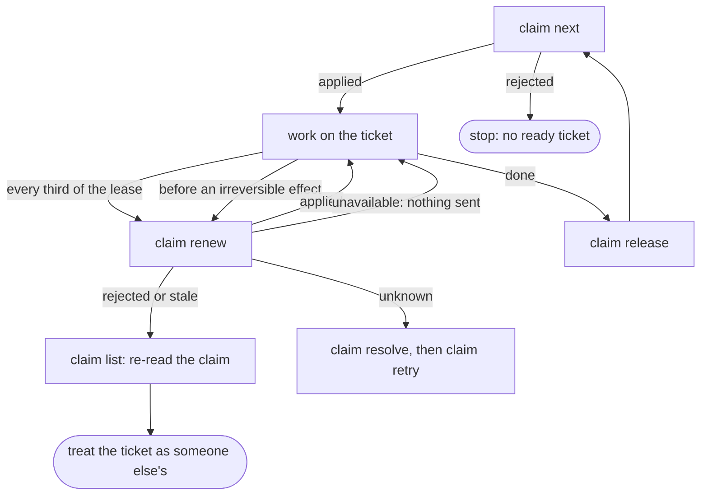

Builds on [S1], [S2], [S4]. Tested: acquire races, lease expiry and reclaim, lost replies, cut and stalled links
([the evidence repository][evidence]).

## 2. An agent fleet on one backlog

For N workers that pull from the same backlog without a dispatcher.

1. Every worker runs the heartbeat loop above with the same filters for `claim next`. The dependency gate keeps
   tickets with open dependencies out of the candidate list ([S5]).
2. Two workers that meet at the same first candidate are decided by the coordination area: one `applied`, one
   `rejected` with `not-free`; the loser moves on to its next candidate ([S3]). There is no fairness; a worker that
   keeps losing should widen its filters or wait.
3. A coordinator, human or agent, watches `backlog claim list --json` beside `backlog task list --json --revision`
   to see who holds what and which tasks changed under a holder (reference section "Owner and ticket changes").

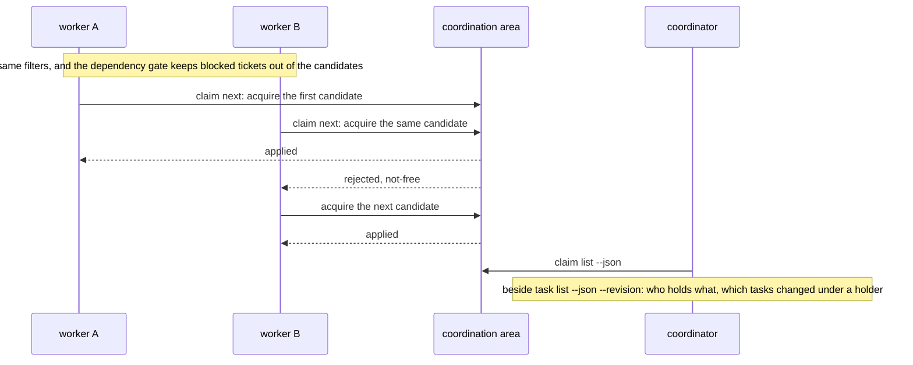

Builds on [S3], [S4], [S5], [S11]. Tested: three clients racing on one ticket, `claim next` under contention up to
1000 claims ([the evidence repository][evidence], sizes and latency). Not tested: more than three clients at once.

## 3. Hand-over between agents

For a ticket that moves from one agent to another, for example from a planner to an implementer, or when a
worker is replaced before it finishes.

1. The holder runs `backlog claim transfer <ticket> --to-context <receiver> --owner <receiver name>` with a
   fresh lease window ([S7]). The receiver is not notified; it finds the claim as `held` in its own
   `claim list` and renews it under its own context from then on.
2. In a project with hard ends the hand-over decides about the time box: `--time-box preserve` keeps the end,
   `--time-box restart --hard-end <iso>` starts a new one over the time path ([S14]).
3. A hard end that turns out too short is extended over the time path ([S13]). A restart without `--hard-end`
   stays `rejected` with `requires-time-path`; this is the designed stop, not an error to work around.

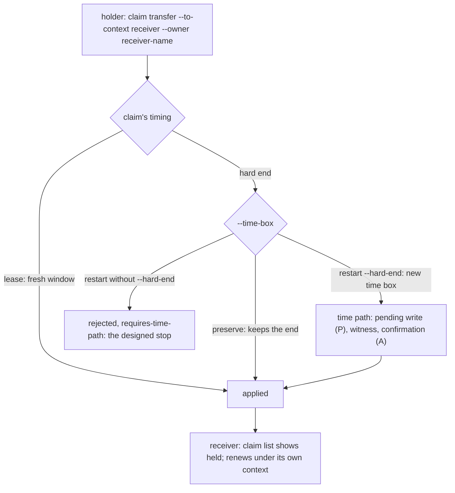

Builds on [S7], [S13], [S14]. Tested: transfer and the time path under skewed clocks ([the evidence repository][evidence]).

## 4. People and agents on one backlog

For a team where a person sometimes takes a ticket back from an agent, or shortens an agent's claim.

1. A person acquires with their own context like any agent; `--owner` carries their display name. Only the
   holder can change a claim's bounds ([S9]), so an agent that is asked to give a ticket up transfers it ([S7]) or
   releases it.
2. To take a ticket from an agent that does not cooperate, wait for the boundary and `claim reclaim`, or, as a
   listed recovery authority, `claim emergency-release`. Then set the task's assignee or stop the worker: the
   former holder keeps running until its next `renew` or `list`, and nothing reassigns automatically.
3. Reports read the JSON, never the text ([S12]).

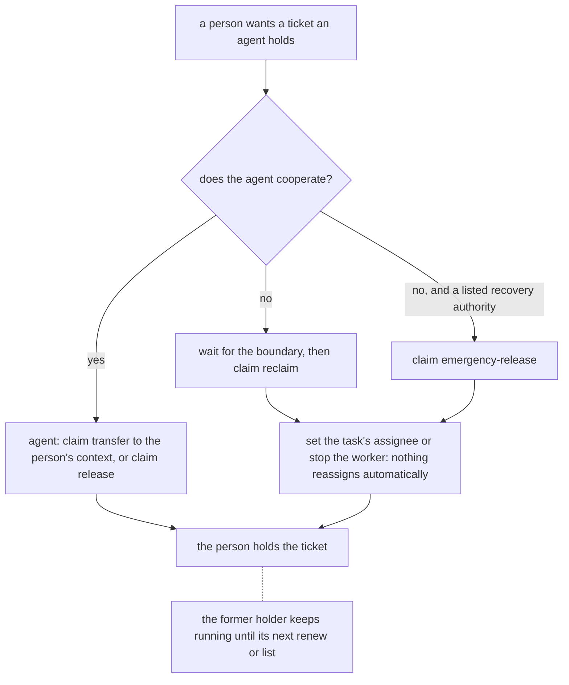

Builds on [S7], [S9], [S12] and the reference section "Emergency release and new epochs". Tested: bound changes,
reclaim after the boundary, emergency release ([the evidence repository][evidence]). Not tested: the agent's own stopping
logic, which is outside claims by design ("No worker stopping", proposal 9).

## 5. Recovery runbook

For the operator who has to clean up after an agent that crashed, disappeared or lost its reply.

| situation | what to do | where |
| --- | --- | --- |
| a command's reply was lost | `claim resolve`, then retry; never retry blind | [S6], recipe "Lost reply: resolve, then retry" |
| a worker crashed mid-ticket | replace it: `claim context create --recover-from <old context>`, then `claim resume` takes its claims over in one step | [S8] |
| a worker is gone for good | clean up its claims after their boundaries; `claim reclaim-batch` with a preview for many | [S10], recipe "Free a claim whose holder is gone" |
| a holder must be freed now | `claim emergency-release` by a recovery authority; then set the task's assignee or stop the workers, because nothing reassigns automatically | reference "Emergency release and new epochs" |
| the coordination area was restored from a backup | install a new epoch with the documented isolation steps; every paused context resumes from there | [S15], recipe "Install a new epoch after a restore" |

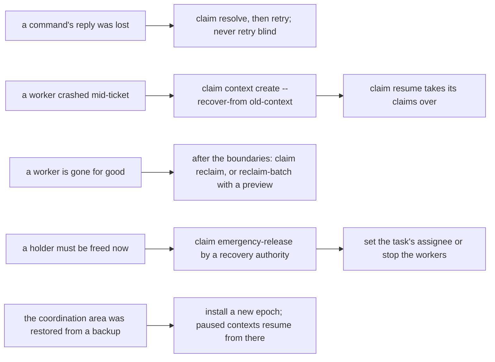

Builds on [S6], [S8], [S10], [S15] and the recipes named. Tested: lost replies, batch reclaim with preview, restore
and new epochs, incompatible data ([the evidence repository][evidence]). Not tested: how a context that the restore paused
gets out of the pause beyond one check that the restored proof works again.

## 6. Claims in a CI job

A proposal only; nothing of it was tested.

1. The job acquires with `--hard-end` set to the job's own deadline, so a killed job frees the ticket by itself:
   after the hard end plus the grace it is reclaimable.
2. The job releases on success and on failure.
3. The job's context directory lives in the runner's workspace; a runner that reuses workspaces must not share
   it between concurrent jobs.

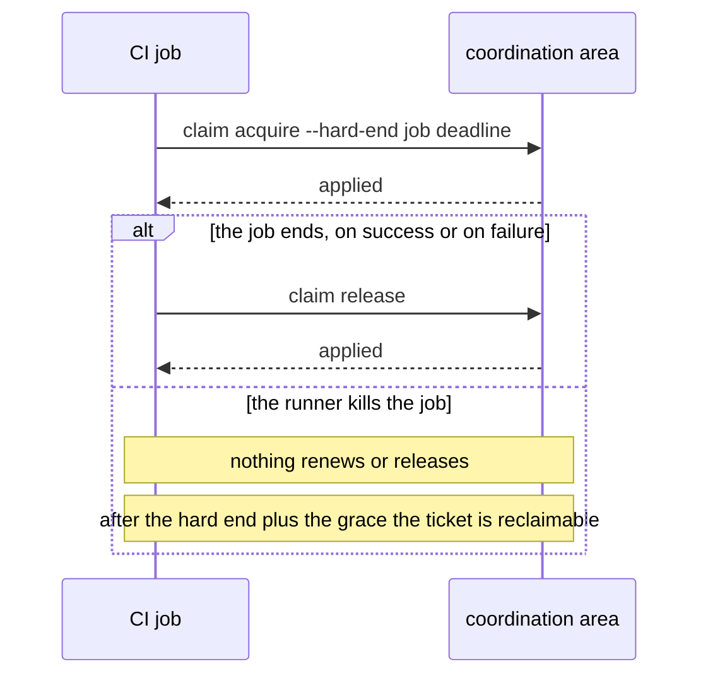

The lease mode is the wrong fit here because nothing renews after the runner kills the job; the hard end is the
designed tool for that case.

## 7. An external effect under a claim

For an agent whose work ends in something that cannot be undone: a push, a deploy, a payment, a mail.

1. Renew right before the effect and go on only when that renew is `applied` (recipe "Renew before an irreversible
   effect", [S2]). `rejected`, `stale` or `unknown` from that renew means: do not run the effect; on `unknown`,
   resolve first.
2. Make the effect idempotent or key it with the ticket and the claim, so that a second run of the same step
   changes nothing and a run under a claim that has ended is recognised by the receiving system.
3. Accept that a window remains. The claim can end between the renew and the effect, and nothing stops a write by
   an agent whose claim was taken over: a claim narrows the window, it is not a fence. Where the effect must be
   exclusive, the receiving system has to check.

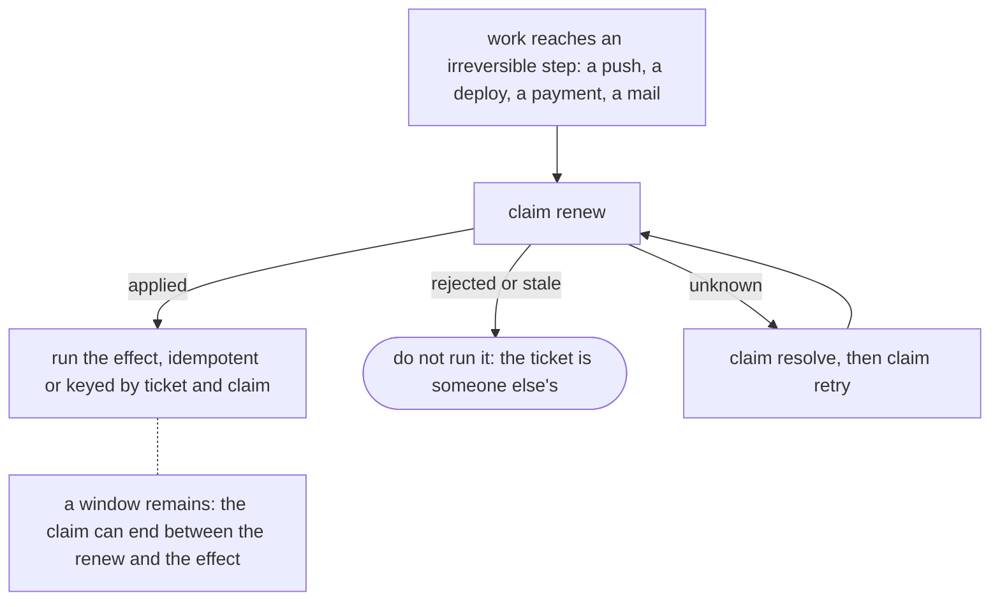

Builds on [S2], the recipe "Renew before an irreversible effect" and proposal 1 step 2. Tested: the renew paths and
the statuses they end with ([the evidence repository][evidence]). Not tested: the window itself cannot be tested away, and
nothing in claims measures what an external system does with a stale writer.

## 8. Spread work over several workers

For a fleet whose tickets should not all be fought over by every worker.

1. Partition the backlog with the filter flags of `claim next` (`--labels`, `--milestone`, `--priority`, …), one
   filter set per worker, so that two workers rarely meet at the same first candidate ([S4], proposal 2).
2. A worker that loses repeatedly with `not-free` widens its filters or waits a random interval before its next
   `claim next`. There is no fairness and no queue: the coordination area decides each race ([S3]).
3. A coordinator reads `backlog claim list --json` to see the load per owner and adjusts the partition. Nothing
   arbitrates for you.

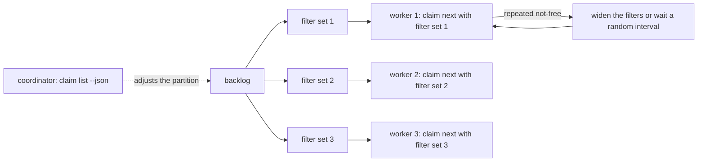

Builds on [S3], [S4], [S5] and proposal 2. Tested: races between three clients and `claim next` under contention
([the evidence repository][evidence]). Not tested: more than three clients, and whether a partition reduces the losses, which
depends on your backlog.

## 9. Stop a former holder safely

For the operator who has to take a ticket from a running worker.

1. A worker written like proposal 1 stops itself: on `rejected` or `stale` from a renew it stops work on the ticket
   and treats it as someone else's ([S11]). Such a worker needs no outside stop, only a freed ticket.
2. Free the ticket: wait for the boundary and `claim reclaim`, or, as a listed recovery authority,
   `claim emergency-release` (proposal 4 step 2, [S10]).
3. If the worker does not stop itself, stop the process by whatever runs it: the fleet manager, the CI runner,
   `kill`. Claims do not; the former holder keeps running until its next `renew` or `list`.
4. Only then reassign: set the task's assignee, or let `claim next` take the ticket. Nothing reassigns
   automatically, and a running `claim next` loop may take the freed ticket at once, so the order is free, stop,
   reassign.

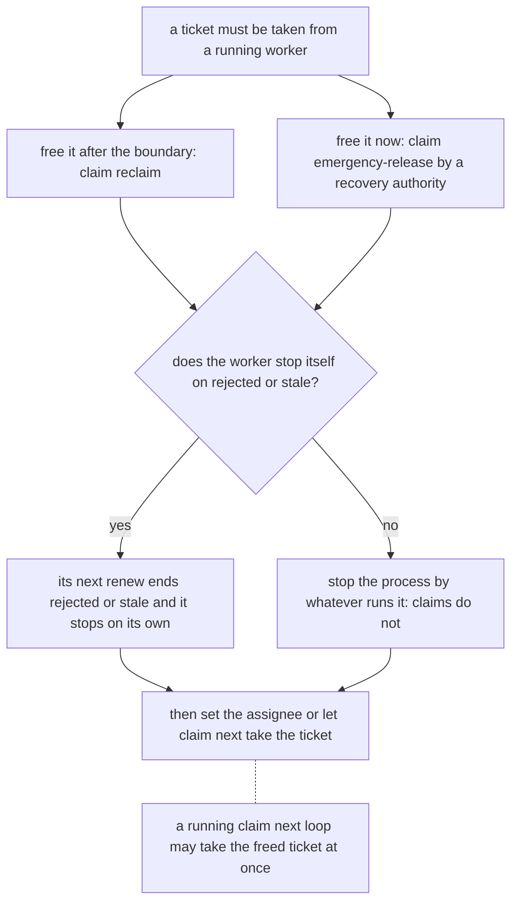

Builds on [S10], [S11], proposal 4 step 2 and proposal 5. Tested: reclaim after the boundary, emergency release, the
statuses a former holder sees ([the evidence repository][evidence]). Not tested: the stopping itself, which happens outside
claims.

## 10. When the Git server is unreachable

For an agent that loses the coordination area in the middle of a ticket.

1. Treat `unavailable` and `unknown` as not knowing. `unavailable` means nothing was sent; `unknown` means the reply
   was lost and the write may have landed ([S6], [S11]).
2. Stop irreversible work. A claim is only as current as the last read of the coordination area, and without the
   endpoint nothing can be acquired, renewed or checked while the lease keeps running out.
3. When the server is back, `claim resolve` first and act on its answer, then retry once (recipes "Lost reply:
   resolve, then retry" and "Resolve before acting on unknown"). A renew that comes back `rejected` or `stale`
   means the ticket moved on while you were away.
4. Reversible work may continue locally at your own risk; its result is worth keeping only if the claim is still
   yours afterwards.

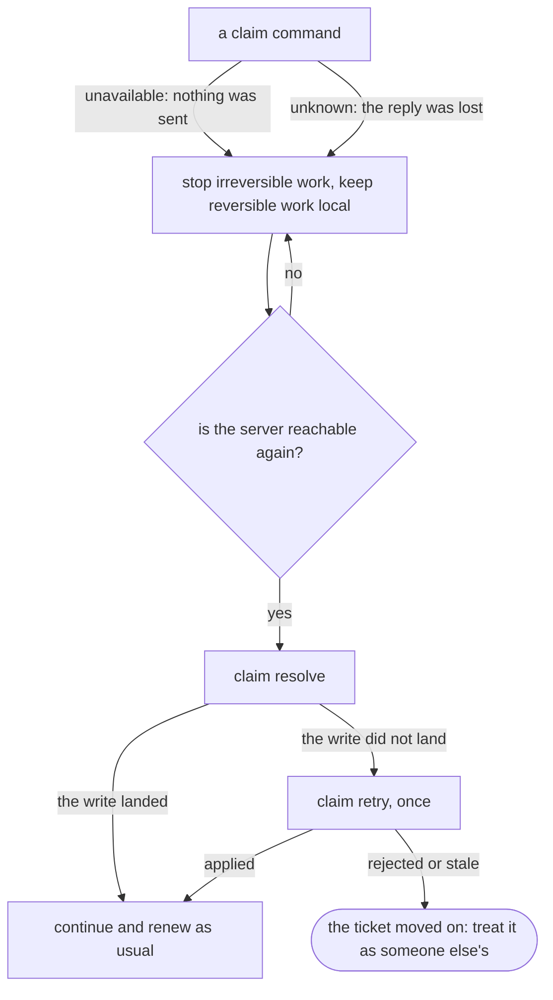

Builds on [S6], [S11] and the two recipes named. Tested: cut, stalled and throttled links, lost replies ([the evidence repository][evidence]).
Not tested: an outage longer than a lease, beyond what the lease rules imply.

## 11. Take several tickets together

For work that touches more than one ticket at a time.

1. Acquire the tickets one by one in a fixed order that every agent uses, for example by ticket ID, so that two
   agents going for the same set never hold one each and wait for the other ([S1], [S3]).
2. Start work only when every acquire ended `applied`. On the first `rejected`, release everything already held and
   try again later or with a smaller set. There is no all-or-nothing, no snapshot and no rollback.
3. Renew every held ticket in the heartbeat loop (proposal 1). A lapsed one is lost on its own; the others are not
   affected.
4. Release in any order when done.

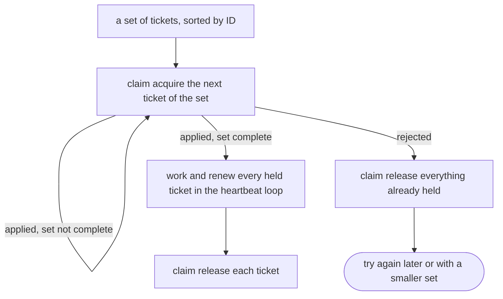

Builds on [S1], [S3] and proposal 1. Tested: single acquires and races on one ticket ([the evidence repository][evidence]). Not tested:
this proposal as a whole; no measurement covered sets of tickets.

## 12. Follow owner and ticket changes

For a coordinator or a dashboard that wants to see who holds what and what changed under a holder.

1. Poll `backlog claim list --json` beside `backlog task list --json --revision` at a modest interval and join the
   two by ticket ID; the reference section "Owner and ticket changes" describes the join. Compare revisions, never
   infer fields from them.
2. Expect to see only what this working copy holds: a `revision` changes when the task file in this checkout
   changes, so pull first if you want foreign edits, and `--watch` may coalesce intermediate edits.
3. Keep the interval modest. Every poll is a claim read, and a tool that fires Git commands in tight succession is
   the one that meets the limit in [Claims known limits](doc-6%20-%20Claims-known-limits.md) ("Other Git commands in the same checkout
   during a claim read").

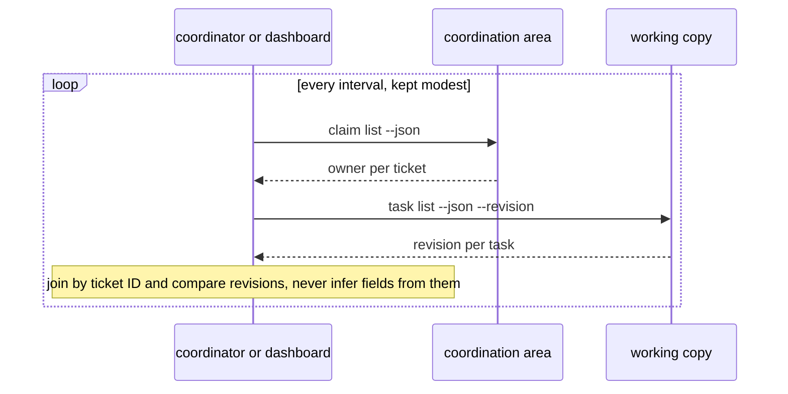

Builds on proposal 2 step 3, the reference section "Owner and ticket changes" and the guide "Claims known
limits". Tested:
`claim list` up to 1000 claims ([the evidence repository][evidence]), and the poller's limit was measured for the known-limits page.
Not tested: the join itself at scale.

## 13. Switch claims off cleanly

For a project that stops using claims, or pauses them during maintenance.

1. Set `enabled: false` in the `claims:` block of the project configuration (reference section "Configuration").
   From then on no new claim can be acquired: `claim acquire` and `claim next` end `claims-disabled`, and a bound
   change that would extend a claim stays `rejected`.
2. Existing claims keep their times. Let the holders finish and release, or wait for the boundaries and
   `claim reclaim`; renew, release, reclaim after the boundary and transfer without a new hard end still work.
3. Stop the agents' loops: a heartbeat loop keeps renewing a held claim until it releases. `claim emergency-release`
   and `claim install-epoch` run under `enabled: false` too, for the operator who needs them.
4. Nothing is cleaned up by itself. When the claims should go for good, release or reclaim everything first, then
   take the block out; the coordination area keeps its history either way.

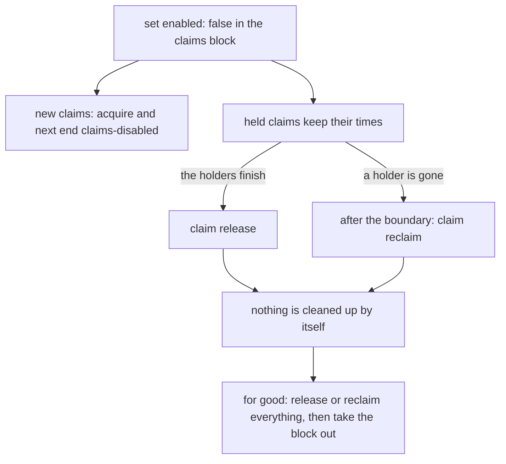

Builds on the reference section "Configuration" and the bullet "`enabled: false` only stops new claims" in
CLAIMS.md. Tested: `enabled: false` against held claims ([the evidence repository][evidence]). Not tested: the sequence as a whole; it is a
proposal.

[S1]: ../../CLAIMS.md#s1-first-claim
[S2]: ../../CLAIMS.md#s2-heartbeat-under-a-lease
[S3]: ../../CLAIMS.md#s3-two-agents-one-ticket
[S4]: ../../CLAIMS.md#s4-claim-the-next-ready-ticket
[S5]: ../../CLAIMS.md#s5-dependency-gate
[S6]: ../../CLAIMS.md#s6-lost-reply
[S7]: ../../CLAIMS.md#s7-hand-a-claim-to-a-colleague
[S8]: ../../CLAIMS.md#s8-replace-a-crashed-agent
[S9]: ../../CLAIMS.md#s9-shorten-a-claim
[S10]: ../../CLAIMS.md#s10-clean-up-after-a-departed-agent
[S11]: ../../CLAIMS.md#s11-errors-an-agent-meets
[S12]: ../../CLAIMS.md#s12-reading-a-result-without-parsing-the-text
[S13]: ../../CLAIMS.md#s13-extend-a-hard-end-over-the-time-path
[S14]: ../../CLAIMS.md#s14-restart-a-hand-overs-time-box
[S15]: ../../CLAIMS.md#s15-a-witnessed-transition
[evidence]: https://github.com/lunetics/backlog-md-claims-qualification
