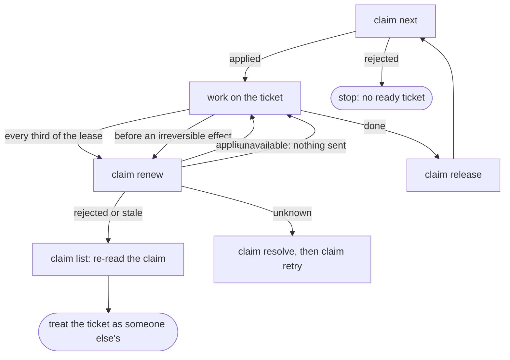
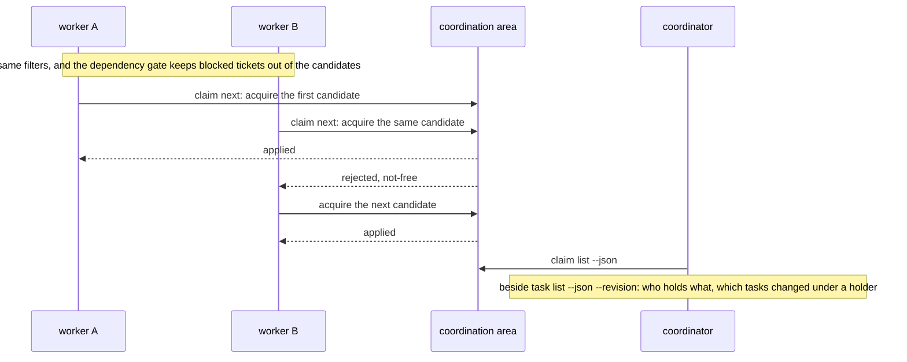
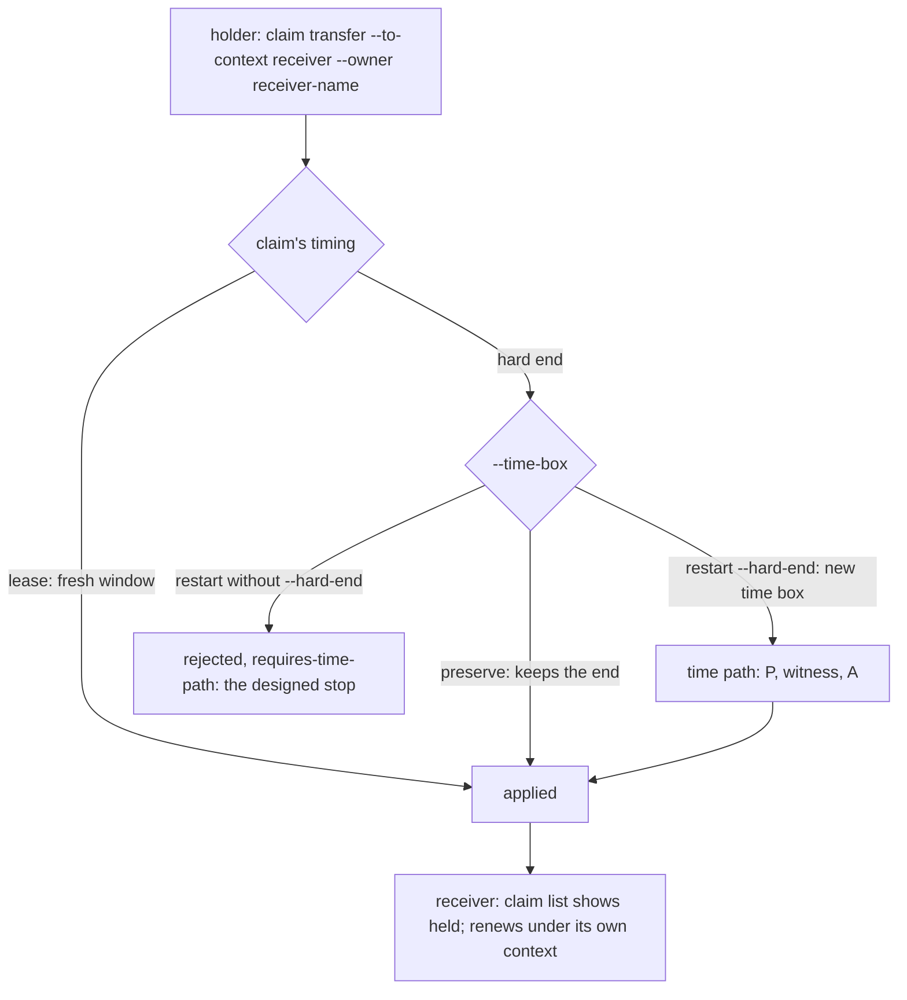
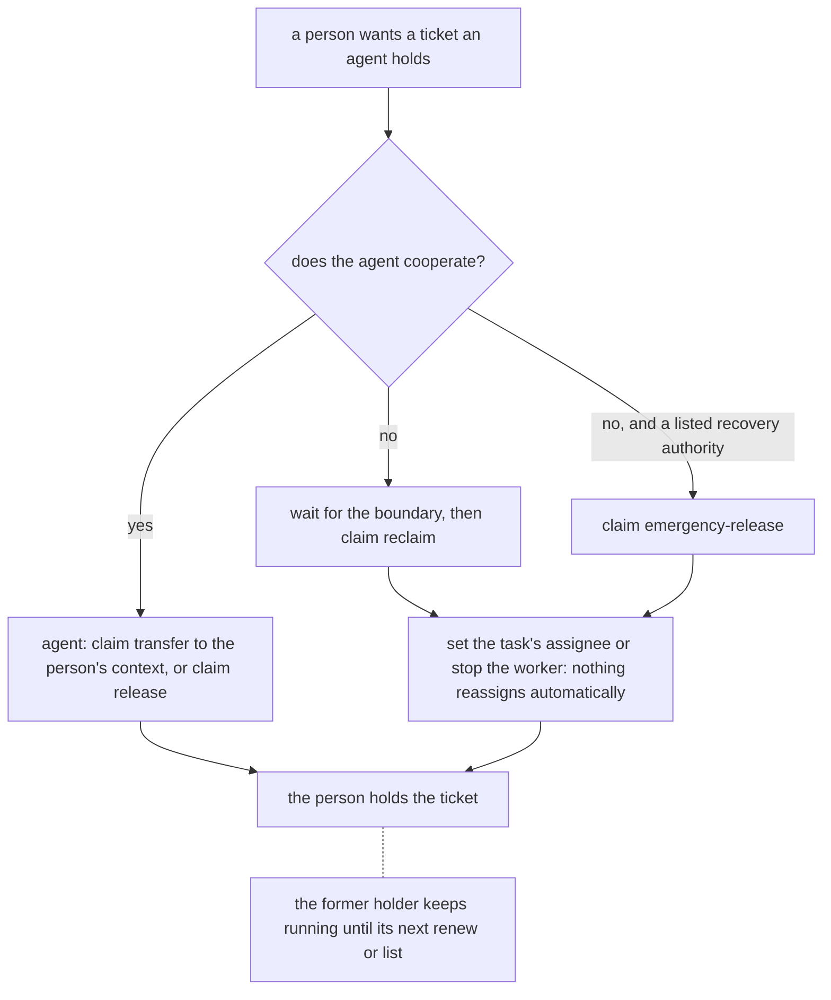
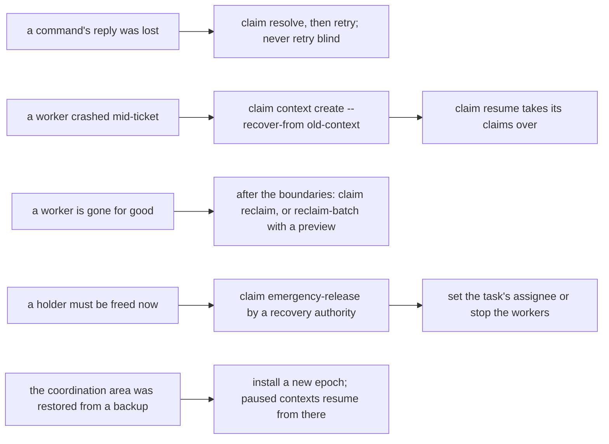
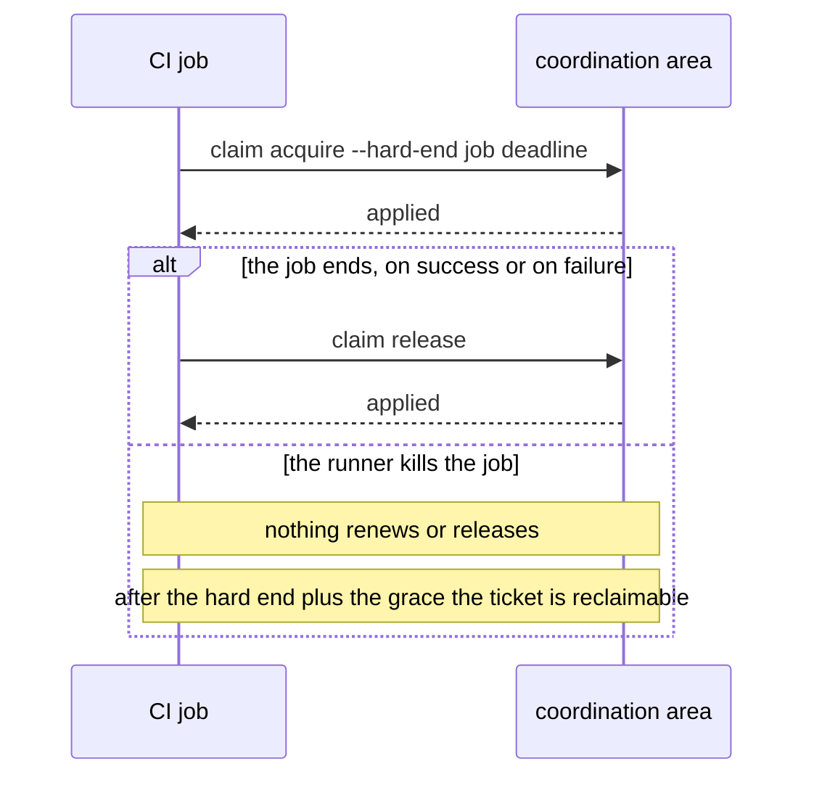

# Claims: workflow proposals

Six ways to run claims in a team or an agent fleet. Each proposal is built from the worked workflows (S1 to S15)
and recipes in [CLAIMS.md](../../CLAIMS.md), which carry the commands and the expected JSON. Where a proposal
rests on something that was not measured, it says so.

Common ground for all six: every agent has its own private context directory; agents read the JSON and never
parse the text; a lost reply is resolved before anything is retried (recipe "Lost reply: resolve, then retry");
and nobody acts on `unknown` (recipe "Resolve before acting on unknown").

## 1. One agent, lease mode, heartbeat loop

For a single long-running agent that picks tickets from a backlog shared with people.

1. `backlog claim next --owner <name> --context <handle> --json`, with the filter flags of `task list` if the
   agent serves only part of the backlog, takes the first ready ticket ([S4]). Stop when it answers `rejected`.
2. Work. Run `backlog claim renew` every third of the lease (recipe "Heartbeat loop", [S2]). Renew once more
   before any irreversible effect such as a push or a deployment (recipe "Renew before an irreversible effect").
   An `unavailable` renew sent nothing and is tried again at the next beat.
3. On `rejected` or `stale` from a renew: stop, re-read the claim with `claim list`, and treat the ticket as
   someone else's. On `unknown`, stop as well and resolve first (recipe "Lost reply: resolve, then retry").
4. `backlog claim release` when done ([S1]).

Builds on [S1], [S2], [S4]. Measured: acquire races, lease expiry and reclaim, lost replies, cut and stalled links
(QUALIFICATION.md stages A and B).

## 2. An agent fleet on one backlog

For N workers that pull from the same backlog without a dispatcher.

1. Every worker runs the heartbeat loop above with the same filters for `claim next`. The dependency gate keeps
   tickets with open dependencies out of the candidate list ([S5]).
2. Two workers that meet at the same first candidate are decided by the coordination area: one `applied`, one
   `rejected` with `not-free`; the loser moves on to its next candidate ([S3]). There is no fairness; a worker that
   keeps losing should widen its filters or wait.
3. A coordinator, human or agent, watches `backlog claim list --json` beside `backlog task list --json --revision`
   to see who holds what and which tasks changed under a holder (reference section "Owner and ticket changes").

Builds on [S3], [S4], [S5], [S11]. Measured: three clients racing on one ticket, `claim next` under contention up to
1000 claims (QUALIFICATION.md "Sizes and latency"). Not measured: more than three clients at once.

## 3. Hand-over between agents

For a ticket that moves from one agent to another, for example from a planner to an implementer, or when a
worker is replaced before it finishes.

1. The holder runs `backlog claim transfer <ticket> --to-context <receiver> --owner <receiver name>` with a
   fresh lease window ([S7]). The receiver is not notified; it finds the claim as `held` in its own
   `claim list` and renews it under its own context from then on.
2. In a project with hard ends the hand-over decides about the time box: `--time-box preserve` keeps the end,
   `--time-box restart --hard-end <iso>` starts a new one over the time path ([S14]).
3. A hard end that turns out too short is extended over the time path ([S13]). A restart without `--hard-end`
   stays `rejected` with `requires-time-path`; this is the designed stop, not an error to work around.

Builds on [S7], [S13], [S14]. Measured: transfer and the time path under skewed clocks (stages A and C).

## 4. People and agents on one backlog

For a team where a person sometimes takes a ticket back from an agent, or shortens an agent's claim.

1. A person acquires with their own context like any agent; `--owner` carries their display name. Only the
   holder can change a claim's bounds ([S9]), so an agent that is asked to give a ticket up transfers it ([S7]) or
   releases it.
2. To take a ticket from an agent that does not cooperate, wait for the boundary and `claim reclaim`, or, as a
   listed recovery authority, `claim emergency-release`. Then set the task's assignee or stop the worker: the
   former holder keeps running until its next `renew` or `list`, and nothing reassigns automatically.
3. Reports read the JSON, never the text ([S12]).

Builds on [S7], [S9], [S12] and the reference section "Emergency release and new epochs". Measured: bound changes,
reclaim after the boundary, emergency release. Not measured: the agent's own stopping logic, which is outside
claims by design ("No worker stopping").

## 5. Recovery runbook

For the operator who has to clean up after an agent that crashed, disappeared or lost its reply.

| situation | what to do | where |
| --- | --- | --- |
| a command's reply was lost | `claim resolve`, then retry; never retry blind | [S6], recipe "Lost reply: resolve, then retry" |
| a worker crashed mid-ticket | replace it: `claim context create --recover-from <old context>`, then `claim resume` takes its claims over in one step | [S8] |
| a worker is gone for good | clean up its claims after their boundaries; `claim reclaim-batch` with a preview for many | [S10], recipe "Free a claim whose holder is gone" |
| a holder must be freed now | `claim emergency-release` by a recovery authority; then set the task's assignee or stop the workers, because nothing reassigns automatically | reference "Emergency release and new epochs" |
| the coordination area was restored from a backup | install a new epoch with the documented isolation steps; every paused context resumes from there | [S15], recipe "Install a new epoch after a restore" |

Builds on [S6], [S8], [S10], [S15] and the recipes named. Measured: lost replies, batch reclaim with preview, restore
and new epochs, incompatible data (stages B and C). Not measured: how a context that the restore paused
gets out of the pause beyond one check that the restored proof works again.

## 6. Claims in a CI job

A proposal only; nothing of it was measured.

1. The job acquires with `--hard-end` set to the job's own deadline, so a killed job frees the ticket by itself:
   after the hard end plus the grace it is reclaimable.
2. The job releases on success and on failure.
3. The job's context directory lives in the runner's workspace; a runner that reuses workspaces must not share
   it between concurrent jobs.

The lease mode is the wrong fit here because nothing renews after the runner kills the job; the hard end is the
designed tool for that case.

[S1]: ../../CLAIMS.md#s1-first-claim
[S2]: ../../CLAIMS.md#s2-heartbeat-under-a-lease
[S3]: ../../CLAIMS.md#s3-two-agents-one-ticket
[S4]: ../../CLAIMS.md#s4-claim-the-next-ready-ticket
[S5]: ../../CLAIMS.md#s5-dependency-gate
[S6]: ../../CLAIMS.md#s6-lost-reply
[S7]: ../../CLAIMS.md#s7-hand-a-claim-to-a-colleague
[S8]: ../../CLAIMS.md#s8-replace-a-crashed-agent
[S9]: ../../CLAIMS.md#s9-shorten-a-claim
[S10]: ../../CLAIMS.md#s10-clean-up-after-a-departed-agent
[S11]: ../../CLAIMS.md#s11-errors-an-agent-meets
[S12]: ../../CLAIMS.md#s12-reading-a-result-without-parsing-the-text
[S13]: ../../CLAIMS.md#s13-extend-a-hard-end-over-the-time-path
[S14]: ../../CLAIMS.md#s14-restart-a-hand-overs-time-box
[S15]: ../../CLAIMS.md#s15-a-witnessed-transition
